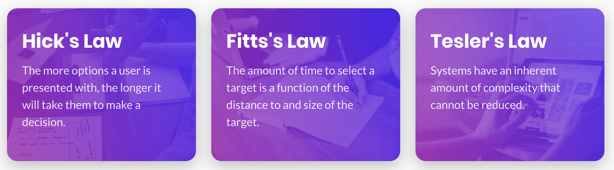

# WDI Documentation - Michael Allen

## Introduction

## Methodology

### Agile Methodology
The methodology followed throughout the process of creating the design for this application was an [Agile Methodology](https://stackify.com/agile-methodology/), which allows for adaptive planning and short delivery times. Due to the nature of following a design route, with focus on the design of the application, this methodology was paramount in ensuring that designs can be created to the highest standard as Agile Methodology allows for fast and flexible improvements to be made throughout the use of regular user testing and shorter design iterations. Based on the feedback gained throughout the process of using an Agile Methodology, the design success was tracked and improved progressively prior to the implementation of the final developed prototype.This eliminated the need to rework the code after implementation to change the design, as the designs were already tested and proven successful beforehand.
### Testing Techniques
In order to test the suitability of the design, the online survey tool [SurveyMonkey](https://www.surveymonkey.com) was used with a link to an online clickable prototype for respondents to preview the design. The questions within the surveys were a mix of quanitative and qualitative questions, with different aims depending on the phase of the design.

For the designs produced during phase one and two (Medium Fidelity), the questions focussed on gaining feedback regarding the layout, navigation and content organisation of the design, whilst stage three (High Fidelity) aimed to gain an understanding on the success surrounding colour scheme, typography and legibility.

When designing the questions for the survey, it was important to ensure that they are formulated carefully in order to ensure the quality of the responses and avoid any biases from leading questions that may provoke a certain response from a respondent. In order to ensure the questions used for the survey were appropriate, a short [pilot survey](https://www.ined.fr/en/resources-methods/survey-methodology/methodological-choices/questionnaire-design-and-testing/) was conducted where the uses were given a public design to answer a few questions about. By doing this, I identified an error with one of the questions which led to bias, in which the respondents were asked: "What was your first thought/emotion when seeing the design? (E.G Stressed, Calm, Intrigued)". The responses that came back were clearly influenced with the examples I gave, and therefore I ensured to remove that section of the question for the surveys in which I tested my designs.

In order to gain feedback from a realistic use-base of students that commonly use university portals, the survey links were shared around with my peers, however due to the nature of receiving potentially biased responses from friends, they were also distributed into Facebook groups that surrounded around a student community, such as Overheard at Solent. 

## Design Iterations

### Design Inspiration
My initial design inspiration for my first phase of design was [UX Toast](https://www.uxtoast.com). This website's design provides the user with a modern, crisp and organised experience, successfully grouping together sections of information and providing a sense of clear hierarchy and flow. I particularly took inspiration from the blocks of information on the dashboard used to link to pages with more details regarding that UX law.

Image from [UX Toast](https://www.uxtoast.com)

### Phase One - Medium Fidelity V1

### Phase Two - Medium Fidelity V2

### Phase Three - High Fidelity V1

## Implementation