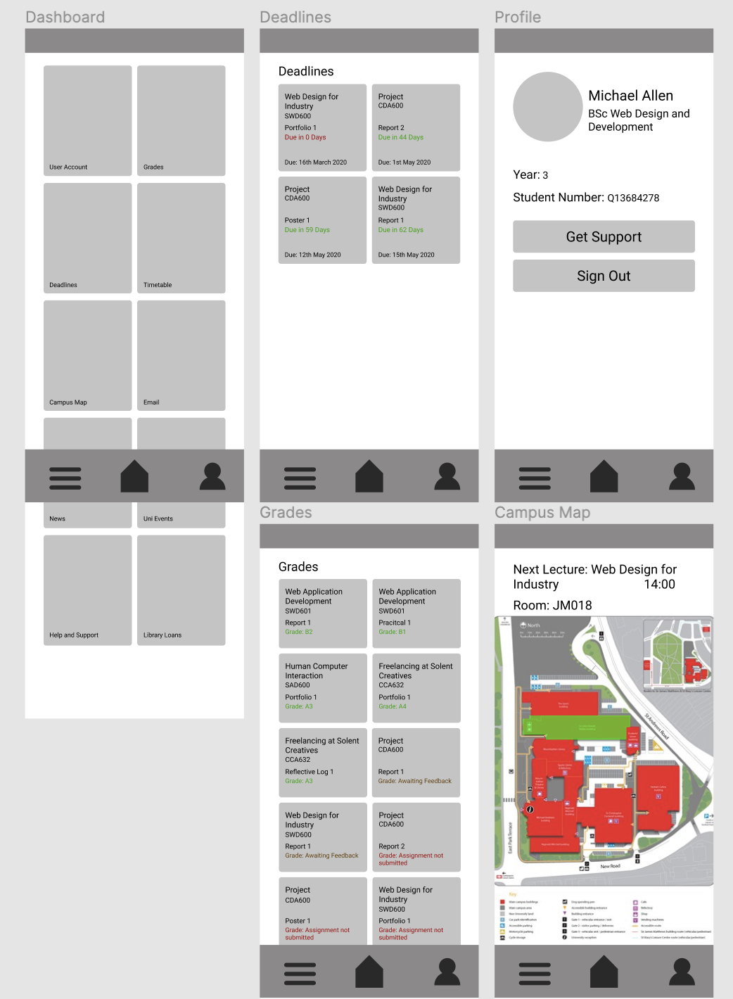

# WDI Documentation - Michael Allen

## Introduction

## Methodology

### Agile Methodology
The methodology followed throughout the process of creating the design for this application was an [Agile Methodology](https://stackify.com/agile-methodology/), which allows for adaptive planning and short delivery times. Due to the nature of following a design route, with focus on the design of the application, this methodology was paramount in ensuring that designs can be created to the highest standard as Agile Methodology allows for fast and flexible improvements to be made throughout the use of regular user testing and shorter design iterations. Based on the feedback gained throughout the process of using an Agile Methodology, the design success was tracked and improved progressively before the implementation of the final developed prototype. This eliminated the need to rework the code after implementation to change the design, as the designs were already tested and proven successful beforehand.
### Testing Techniques
To test the suitability of the design, the online survey tool [SurveyMonkey](https://www.surveymonkey.com) was used with a link to an online clickable prototype for respondents to preview the design. The questions within the surveys were a mix of quantitative and qualitative questions, with different aims depending on the phase of the design.

For the designs produced during phases one and two (Medium Fidelity), the questions focussed on gaining feedback regarding the layout, navigation, and content organisation of the design, whilst stage three (High Fidelity) aimed to gain an understanding on the success surrounding colour scheme, typography, and legibility.

When designing the questions for the survey, it was important to ensure that they are formulated carefully to ensure the quality of the responses and avoid any biases from leading questions that may provoke a certain response from a respondent. To ensure the questions used for the survey were appropriate, a short [pilot survey](https://www.ined.fr/en/resources-methods/survey-methodology/methodological-choices/questionnaire-design-and-testing/) was conducted where the uses were given a public design to answer a few questions about. By doing this, I identified an error with one of the questions which led to bias, in which the respondents were asked: "What was your first thought/emotion when seeing the design? (E.G Stressed, Calm, Intrigued)". The responses that came back were influenced by the examples I gave, and therefore I ensured to remove that section of the question for the surveys in which I tested my designs.

To gain feedback from a realistic use-base of students that commonly use university portals, the survey links were shared around with my peers, however, due to the nature of receiving potentially biased responses from friends, they were also distributed into Facebook groups that surrounded a student community, such as Overheard at Solent. 

## Design Iterations

### Design Inspiration
My initial design inspiration for my first phase of design was [UX Toast](https://www.uxtoast.com). This website's design provides the user with a modern, crisp, and organised experience, successfully grouping sections of information and providing a sense of clear hierarchy and flow. I particularly took inspiration from the blocks of information on the dashboard used to link to pages with more details regarding that UX law.

Image from [UX Toast](https://www.uxtoast.com)

Another aspect I particularly enjoyed with UX Toast's website design is the use of a gradient background overlayed upon an image and is something I used heavily as inspiration within my high fidelity wireframes.

### Creating Designs

Designs for the application were created in [Figma](https://www.figma.com), an online prototyping tool that allows designers to develop interactive prototypes that can be tested showing the intended flow and navigation of the final application once implemented. Before reaching the final designs, three phases were iterated through, starting with medium fidelity. After each phase, the feedback was gained through user testing and this feedback was implemented into the next design phase. It took two phases of medium-fidelity designs before the layout and navigation were fully successful, and a further iteration of high fidelity design to test the colour, typography, and legibility of the design. There were some subtle changes made between phase three and the implementation based on the high fidelity testing.

Before phase one of design testing commenced, an initial survey was conducted to gain an insight into the areas in which students are currently under-served within university portal applications. This survey identified three areas in which students feel need improvement within their current university portal.

* Accessing a list of all their current grades
* Accessing a list of all upcoming deadlines
* Viewing a campus map

These conclusions were drawn by 77.5% of respondents suggesting that out of a list of features, they would find either results and feedback or a campus map highlighting specific areas to be of the most use.

In addition to this, 60% of students responded "No" to the question "Within your current institution, do you find it easy to access a to-do that displays all upcoming deadlines?"

### Phase One - Medium Fidelity V1

Using the design inspiration from UX Toast, and the results gained from the prior survey, the below medium-fidelity designs were created.

A survey was completed surrounding this design with feedback from 23 respondents and consisted of six questions.

| Question | Type |
|----------|------|
|How do you find the overall layout of the design in terms of navigational ease? (1 - Poor, 5 - Excellent)|Score
|What was your favourite aspect of the design?|Comment
|What was your least favourite aspect of the design?|Comment
|If you would change one thing, what would it be?|Comment
|What was your first thought or emotion when seeing the design?|Comment
|Do you have any other comments regarding the design?|Comment

For question one, the design scored an average of 4.5 stars for navigational ease.

Although it was reassuring to score highly on navigational ease on the first iteration of the prototype, the really useful results came from the qualitative survey questions.

For question two, the majority of respondents stated that their favourite aspect of the application was the ease of navigation, clear layout and structure, and size of the buttons. 

When asked what the user's least favourite aspect of the design was, the most common feedback was the blandness and repetitiveness of the design. The respondents also didn't like that they had to scroll on the dashboard to view all options and felt like there was no clear hierarchy or order of the most important buttons.

These responses were also reflected when asked about one thing they would change in the design, with users often stating making the dashboard fitting above the fold, eliminating the need to scroll. One user correctly pointed out that the guttering between the dashboard buttons wasn't equal horizontally and vertically.

The emotion triggered in the users when accessing the design for the first time successfully met the emotions set out to achieve, being calm, relieved, or thankful that the design was simple and easy to understand.

> "Finally, everything is simple and in one place. I don't have to go around various links and pages to get to what I need." - Anonymous respondent

### Phase Two - Medium Fidelity V2

### Phase Three - High Fidelity V1

## Implementation
